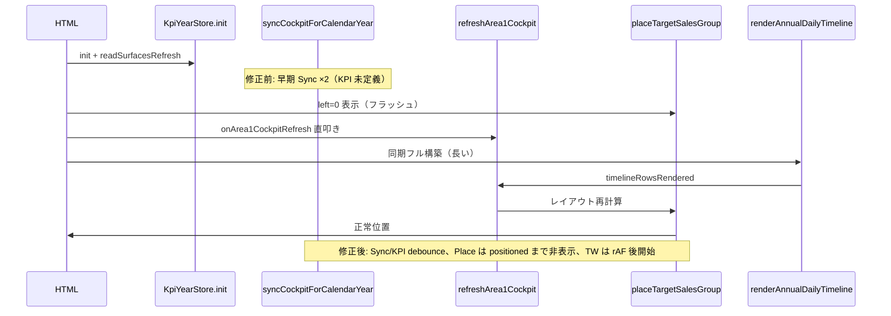

# Annual ページ — 読み込み・Cockpit レイアウト検証メモ

> **共有先:** Codex / Tars など後続エージェント向け  
> **更新日:** 2026-07-06  
> **関連:** `docs/monthly-page-load-performance.md`, `scripts/apply_annual_load_perf.py`

---

## 1. 報告された症状

| 症状 | Monthly（修正前） | Annual（現状） |
|------|-------------------|----------------|
| リロードが重い | 約 30 秒 | Monthly ほどではないが遅い体感 |
| Annual Target Sales の位置 | 一瞬左の日付グループと重なる | **同じ症状あり** |
| 修正後 Monthly | 症状解消 | — |

ユーザー仮説: **Monthly と同じ指示系統（Cockpit 同期の重複・レイアウト確定前の描画）** が Annual にもある。

---

## 2. 検証結果 — 根本原因

### 2.1 Target Sales が左に重なる理由

`.annual-target-sales-group` は CSS で **`left: 0`**（絶対配置の初期値）。

```css
.annual-target-sales-group {
  position: absolute;
  left: 0;   /* ← JS が動くまで日付ボタンと重なる */
  top: 21px;
}
```

正しい位置は `placeTargetSalesGroup()` が **Today ボタンの右端** を基準に `style.left` を計算して設定する。

リロード直後のタイムライン:

1. HTML 描画 → Target Sales は `left: 0` で **日付グループと重なって見える**
2. `placeTargetSalesGroup()` が走るが、**Cockpit 同期が複数回**走り DOM がまだ動いている
3. 数十〜数百 ms 後に再配置 → 正常位置へ

Monthly 修正後は Cockpit 更新の **debounce 化** でレイアウトの揺れが減り、同症状が消えた。Annual は未適用だった。

### 2.2 Monthly と同型の Cockpit 重複（Annual）

| # | 箇所 | 問題 |
|---|------|------|
| A | `syncCockpitForCalendarYear` 直叩き IIFE（~17522） | `refreshArea1Cockpit` 定義前に同期 → 無駄な 12 ヶ月集計 |
| B | `scheduleInitialCockpitSync()` setTimeout(0) | 同上タイミングで再度同期 |
| C | `onArea1CockpitRefresh()` 初回直叩き（~24049） | KPI 帯の重複更新 |
| D | `syncCockpit` 内の `refreshArea1Cockpit()` 直叩き | debounce なしで連鎖 |
| E | `renderAnnualDailyTimeline` **同期**初回（~24133） | メインスレッド長時間ブロック → 配置 JS が遅延 |
| F | `annual:timelineRowsRendered` → 再度 Cockpit 更新 | イベント連鎖 |
| G | `placeTargetSalesGroup` リスナー **二重登録**（JA HTML のみ） | 同一イベントで 2 回配置 |

### 2.3 Monthly との違い

| 項目 | Monthly | Annual |
|------|---------|--------|
| 縦 TW 初回描画 | 遅延 + 2 段階（表示年→全年度） | **常に必要**（行軸 UI の本体） |
| 横列 `rebuildColumns` | リロード時 debounce | なし（Annual に相当 UI なし） |
| Target Sales 配置 | debounce のみで十分だった | **opacity 0 まで必要**（`left:0` フラッシュ対策） |

Annual では TW を大幅に遅延しない。代わりに **Cockpit debounce + 配置完了まで非表示 + TW 初回を rAF×2 で 1 フレーム譲る**。

---

## 3. 実施した修正（`apply_annual_load_perf.py`）

| 対策 | 内容 |
|------|------|
| Target Sales フラッシュ防止 | `opacity: 0` → `--positioned` 付与後 `opacity: 1` |
| `schedulePlaceTargetSalesGroup` | resize / timeline / readSurfaces を 0ms debounce |
| 重複リスナー削除 | JA の二重 `placeTargetSalesGroup` 登録を 1 組に |
| `syncCockpitForCalendarYearCore` + debounce | Monthly と同型 |
| `calendarYearChanged` → rAF | 年変更時の同期を次フレームに |
| 早期 sync IIFE 削除 | refreshArea1 未定義時の無駄呼び出しを除去 |
| `onArea1CockpitRefresh` debounce | 初回直叩き削除 |
| 初回 TW | `renderAnnualDailyTimeline` を rAF×2 で開始 |

**対象:** `app/annual/index.html`, `en/app/annual/index.html` のみ  
**マーカー:** `/* KPI-ANNUAL-LOAD-PERF */`

### 再適用

```bash
python3 scripts/apply_annual_load_perf.py
```

---

## 4. 指示系統図（リロード時）



---

## 5. 今後の候補（未実装）

- Annual 向け TW **表示年ファースト** 2 段階描画（Monthly Phase E 相当）— 行 UI 全体への影響要回帰
- `computeTwMetricsForIso` キャッシュ
- DB / サーバー集計（Monthly と同様、単独では根本解決にならない）

---

## 6. 変更履歴

| 日付 | 内容 |
|------|------|
| 2026-07-06 | 検証メモ初版 + `apply_annual_load_perf.py` 適用 |
